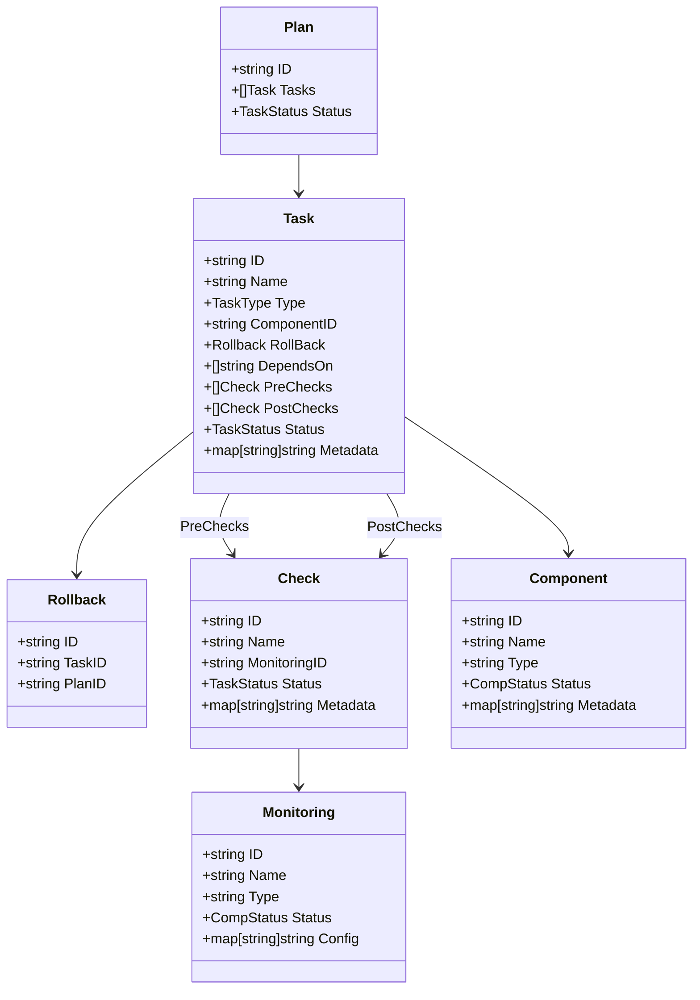

📦 Infrastructure Orchestration Kernel
Этот модуль представляет ядро системы оркестрации инфраструктуры. Он описывает модель данных для управления задачами (tasks), компонентами (components), проверками (checks), мониторингом и откатами (rollback) в рамках плана (plan) изменения инфраструктуры.

🧠 Основные понятия
Plan — план, содержащий последовательность задач (Task), которые необходимо выполнить.

Task — единичная операция: обновление, проверка или откат. Может иметь зависимости и проверки до/после.

Rollback — объект, описывающий, как откатить задачу.

Check — проверка состояния через систему мониторинга.

Component — сущность инфраструктуры, над которой выполняются задачи.

Monitoring — источник данных для проверок (например, URL, агент, сокет).

🧩 Структура
TaskType (тип задачи)
update — обновление компонента

rollback — откат задачи

check — операция проверки

TaskStatus (статус задачи)
pending, running, success, failed, skipped, deferred, retry

CompStatus (статус компонента/мониторинга)
pending, checking, running, failed

📘 Пример использования
```json
{
  "id": "plan-1",
  "tasks": [
    {
      "id": "task-1",
      "name": "Update DB",
      "type": "update",
      "componentID": "db-1",
      "dependsOn": [],
      "preChecks": [
        { "id": "chk-1", "name": "DB Reachable", "monitoringID": "mon-1" }
      ],
      "status": "pending"
    }
  ],
  "status": "pending"
}
```

🗺️ Схема данных (Mermaid)
